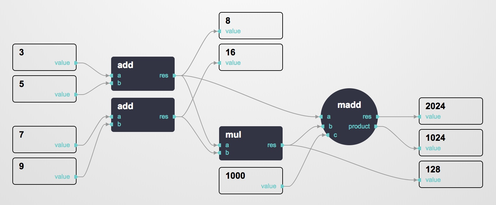

# @thi.ng/estuary

[](https://www.npmjs.com/package/@thi.ng/estuary)

## About

Currently still pre-alpha, a TypeScript based rework of my old (and unreleased)
Estuary Java/Clojure lib for building, executing & visualizing dataflow graphs.



[Live demo](http://demo.thi.ng/umbrella/estuary/)

### Features

(some not yet available)

- plain JS-object node definitions (serialize graphs & layouts as JSON)
- node & port types (and type specific styling options)
- node muting/bypass, node collapse, hidden ports
- growing collection of built-in node types/ops
- immutable graph updates (by default, for easy undo/redo)
- customizable execution models (sync, async, rstream based)
- customizable SVG node components, shapes, edges, port layouts (linear/radial)
- all components defined as plain functions/arrays for [@thi.ng/hiccup-dom](https://github.com/thi-ng/umbrella/tree/master/packages/hiccup-dom)
- basic graph editing UI features (pan/zoom, move nodes etc.)
- lightweight (~12KB minified)

## Installation

```
yarn add @thi.ng/estuary
```

## Usage examples

```typescript
import * as estuary from "@thi.ng/estuary";
```

TODO

Please see bundled demo for now ([index.ts](./src/index.ts))

## Authors

- Karsten Schmidt

## License

&copy; 2012 - 2018 Karsten Schmidt // Apache Software License 2.0
